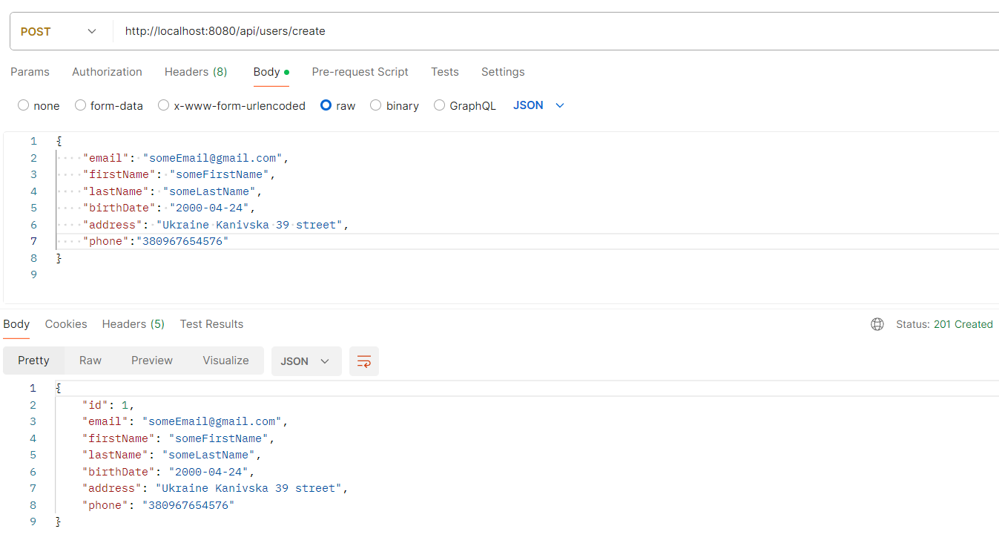
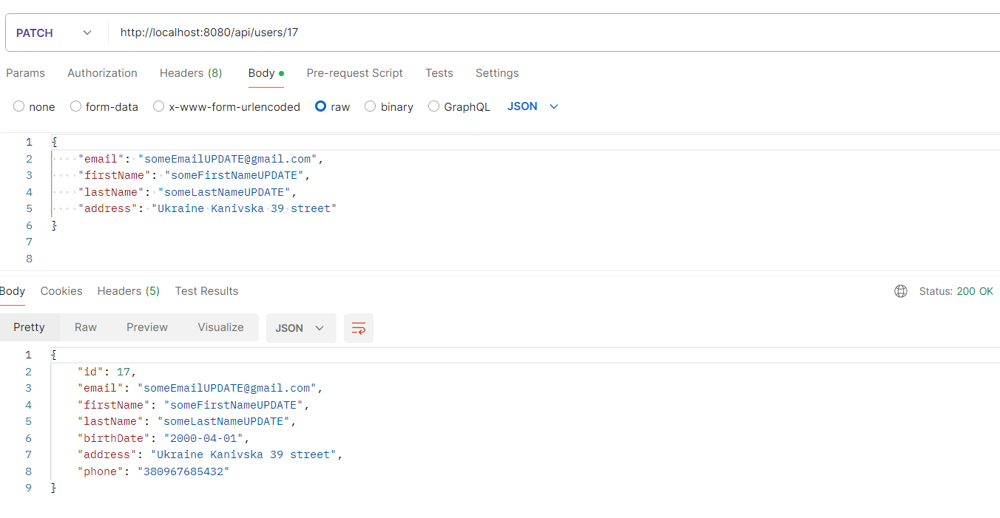
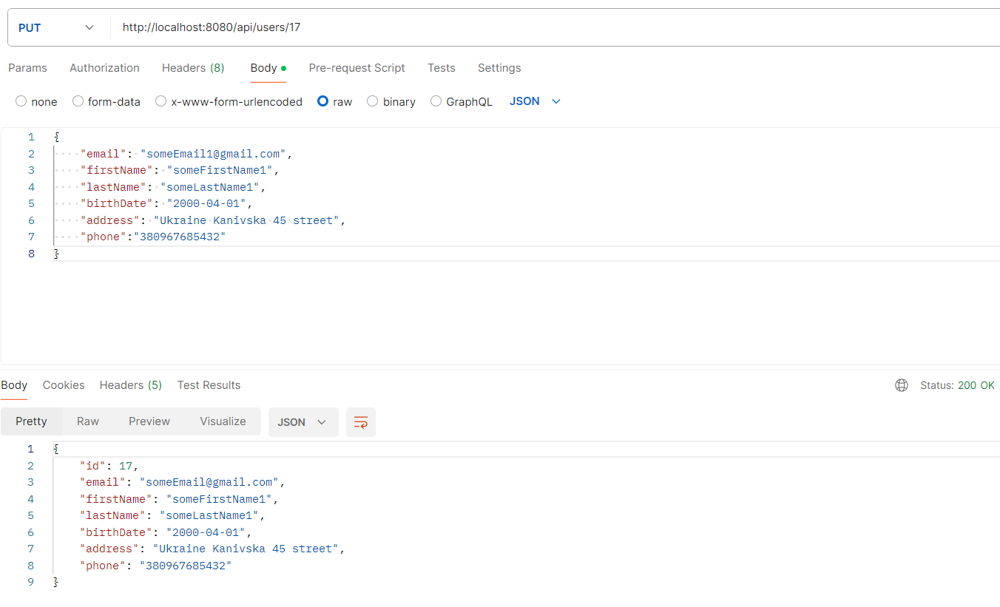
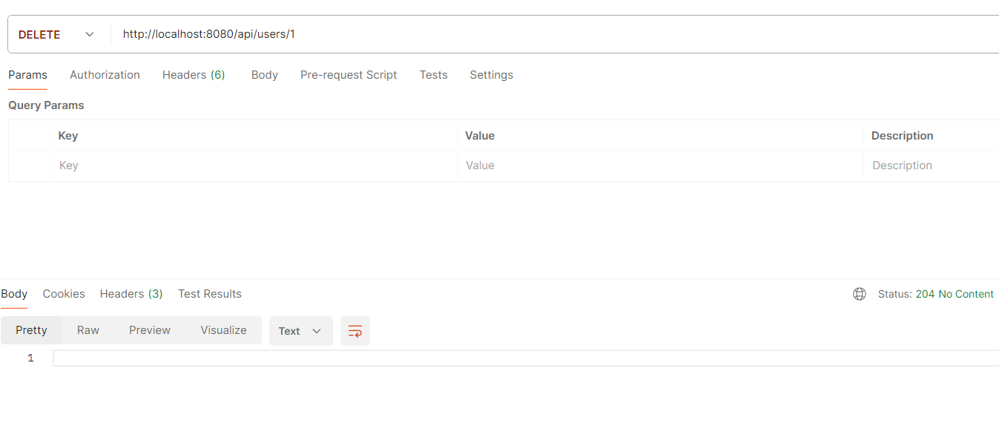
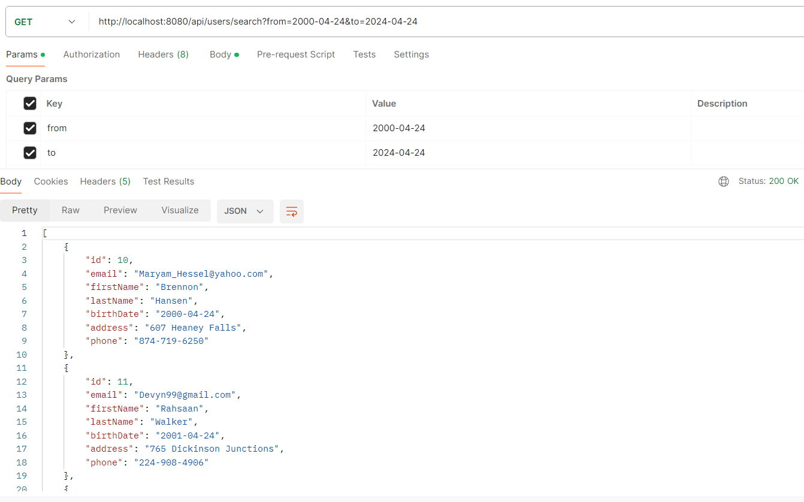

**User Management API**

This project is a RESTful API implementation for managing users, built using Spring Boot. It provides endpoints for creating, updating, deleting users, as well as searching for users within a specified birth date range. The API adheres to best practices in RESTful API design and includes error handling for various scenarios.

### Requirements
1. **Fields**: The API manages user data with fields including email, first name, last name, birth date, address, and phone number.
2. **Functionality**:
    - **Create User**: Allows registration of users who are at least 18 years old.
    - **Update User**: Supports updating individual or all user fields.
    - **Delete User**: Deletes a user from the system.
    - **Search Users by Birth Date Range**: Retrieves a list of users based on a specified birth date range.
3. **Unit Tests**: The code is thoroughly tested using Spring Boot's testing framework.
4. **Error Handling**: Error handling is implemented for various scenarios such as user under age, user already exists, user not found, and invalid requests.
5. **JSON Responses**: All API responses are in JSON format.
6. **Database**: The project does not require a database for data persistence.
7. **Spring Boot Version**: Any version of Spring Boot can be used.
8. **Java Version**: The project can be implemented using any version of Java.

### Getting Started
To run the project, follow these steps:

1. Clone the repository: `git clone <https://github.com/MaksymChalyi/spring-user-api-hub.git>`
2. Open the project in your preferred IDE.
3. Configure the database connection in the `application.properties` file by replacing placeholders with actual database URL, username, and password.
4. Build the project using Maven.
5. Run the application.

### Endpoints
- **Create User**: `POST /api/users/create`
- **Update User**: `PATCH /api/users/{id}`
- **Update All User Fields**: `PUT /api/users/{id}`
- **Delete User**: `DELETE /api/users/{id}`
- **Search Users by Birth Date Range**: `GET /api/users/search?from={from_date}&to={to_date}`

### Endpoint Screenshots

#### Create User

-----

#### Update User

-----

#### Update All User Fields

-----

#### Delete User

-----

#### Search Users by Birth Date Range

-----
### Testing
The project includes unit tests for each service method using Mockito and JUnit. To run the tests, execute the test classes under `src/test/java` directory.

### Dependencies
The project utilizes the following dependencies:
- **Spring Boot Starter Web** for building web applications using Spring MVC.
- **PostgreSQL Driver** for connecting to PostgreSQL databases.
- **Spring Boot Starter Validation** for validating request parameters and payloads.
- **Spring Data JPA** for easy implementation of JPA-based repositories.
- **Flyway Core** for database schema migration management.
- **Project Lombok** for reducing boilerplate code and improving code readability.
- **Spring Boot Starter Test** for testing Spring Boot applications.

### Java Version
The project is implemented using Java version 17.

### Spring Boot Version
The project is built on Spring Boot version 3.2.5.

### License
This project is licensed under the MIT License. See the [LICENSE](LICENSE.md) file for details.